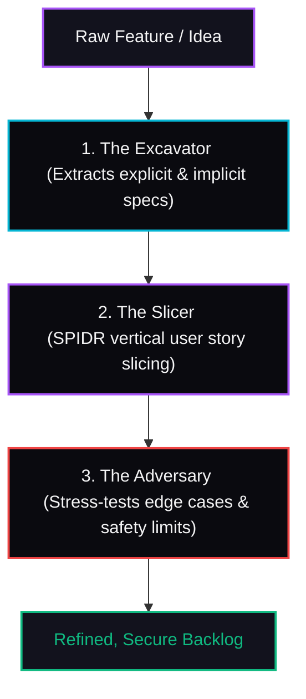

# AI Refinement Matrix Dashboard

A modern, high-performance web dashboard that orchestrates a specialized three-agent team to automate backlog refinement and vertical user story slicing using the **SPIDR framework** and cynical safety audits.




---

## 🚀 Features

*   **Step 1: Spec Excavator**: Mines messy feature ideas and outputs structured Markdown documentation separating core functional workflows from non-functional parameters and identifying missing requirements.
*   **Step 2: Story Slicer**: Automatically splits synthesized specifications into independent, vertically-sliced user stories using the SPIDR framework, complete with Given-When-Then Acceptance Criteria.
*   **Step 3: Stress Audit**: Runs a cynical Adversary agent on selected user stories to identify hidden race conditions, UI locks, security vulnerabilities, or network issues, allowing you to merge the safeguards straight into the story cards.
*   **Release Center**: Exports the final refined backlog to a clean Markdown format or copies it straight to your clipboard for Jira/Linear.
*   **UI/UX Aesthetics**: Premium dark theme with vibrant neon gradients, glassmorphism card controls, real-time loading skeletons, and interactive state transitions.

---

## 🛠️ Technology Stack

*   **Language**: TypeScript (Type safety enforced across client & server)
*   **Frontend**: React (TypeScript, Vite, Lucide Icons, Vanilla CSS Design System)
*   **Backend API**: Hono running on Node.js using `tsx` (TypeScript Execution)
*   **Orchestration Engine**: Runs the Antigravity TUI/CLI (`agy`) via secure child processes (`execFile`) using local custom agents.

---

## 📋 Prerequisites

Ensure you have the following installed on your system:
*   [Node.js](https://nodejs.org/) (v18+)
*   **Antigravity CLI** (`agy`) configured and authenticated.

---

## 🏃 Getting Started

### 1. Configure the Custom Agents
To verify or create the Excavator, Slicer, and Adversary agents on your local machine, make sure the custom markdown agent configurations exist in your global customizations folder.

A complete copy of the custom agents is included in this repository under the `./ai-refinement-plugin` directory. You can easily copy it to your global configurations directory to enable discovery:

*   **Global Plugin Path**: Copy the `ai-refinement-plugin` directory to:
    `~/.gemini/config/plugins/ai-refinement-plugin/`
*   This will register the three agents:
    *   `excavator` (Spec-Driven Synthesis)
    *   `slicer` (Vertical Slicing)
    *   `adversary` (Edge-Case Audit)

### 2. Setup the Workspace
Navigate to this directory and install Node dependencies:
```bash
cd ~/GitHub/ai-refinement-matrix
npm install
```

### 3. Run the App

#### Development Mode (Hot-Reloading)
Runs Hono (port 3000) and the Vite frontend dev server (port 5173) concurrently:
```bash
npm run dev
```
Open your browser and navigate to **[http://localhost:5173](http://localhost:5173)**.

#### Production Mode (Single Server)
Compiles frontend assets and runs the single unified Hono server serving both backend APIs and static assets:
```bash
npm run build
npm start
```
Open your browser and navigate to **[http://localhost:3000](http://localhost:3000)**.

---

## 🖥️ Terminal (CLI) Direct Commands

Since the agent configurations are installed as global customizations, you can also run them directly from any terminal prompt:

```bash
# Run the Excavator
agy --agent excavator --print "As a user, I want a dark mode switch on my dashboard."

# Run the Slicer
agy --agent slicer --print "Spec: [paste spec here]"

# Run the Adversary
agy --agent adversary --print "Story: [paste story details here]"
```
