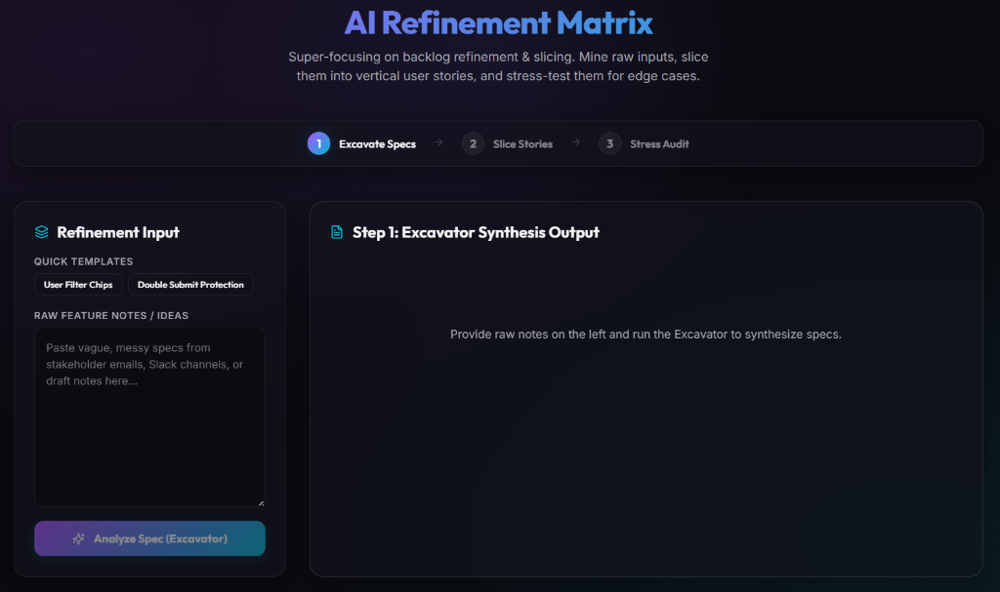

# AI Refinement Matrix Dashboard

A modern, high-performance web dashboard that orchestrates a specialized six-agent team to automate backlog refinement, vertical user story slicing, architectural validation, developer subtask decomposition, and QA test contracting.



📖 **[Read the User Guide](./USER_GUIDE.md)** to learn how to refine your backlog step-by-step.

```
[ PO's Functional Slices ] 
           │
           ▼
┌──────────────────────┐
│  1. The Realist      │ ➔ Audits the PO's slices against actual Code Architecture.
└──────────┬───────────┘
           ▼
┌──────────────────────┐
│  2. The Decomposer   │ ➔ Shatters the approved slice into explicit Technical Tasks.
└──────────┬───────────┘
           ▼
┌──────────────────────┐
│  3. The Guardian     │ ➔ Builds the QA Automation & Testing Contract.
└──────────────────────┘
```

---

## 🚀 Features

*   **Step 1: Spec Excavator**: Mines messy feature ideas and outputs structured Markdown documentation separating core functional workflows from non-functional parameters and identifying missing requirements.
*   **Step 2: Story Slicer & Stress Audit**: 
    *   Automatically splits specs into independent, vertically-sliced user stories using the SPIDR framework.
    *   Runs the cynical **Adversary** agent to flag race conditions, security vulnerabilities, or network issues, allowing you to merge acceptance criteria straight into cards.
*   **Step 2 (Engineering Mode): Technical Refinement Loop**:
    *   **The Realist**: Checks user stories against a shared **Lead Architect Design Doc** to flag compatibility warnings and architectural violations.
    *   **The Decomposer**: Shatters stories into explicit developer subtasks, listing files affected and action steps.
    *   **The Guardian**: Automates the QA contract, detailing Unit, Integration, and Mock Data expectations for each subtask.
    *   **Interactive Checklist**: Edit task details, files, and contracts inline, add manual tasks, or check them off as completed.
*   **Release Center**: Exports the final refined backlog (with developer tasks and test contracts) to Markdown or copy to clipboard for Jira/Linear.

---

## 🛠️ Technology Stack

*   **Language**: TypeScript (Type safety enforced across client & server)
*   **Frontend**: React (TypeScript, Vite, Lucide Icons, Vanilla CSS Design System)
*   **Backend API**: Hono running on Node.js using `tsx` (TypeScript Execution)
*   **Orchestration Engine**: Runs the Antigravity TUI/CLI (`agy`) via secure child processes (`execFile`) using local custom agents.

---

## 📋 Prerequisites

Ensure you have the following installed on your system:
*   [Node.js](https://nodejs.org/) (v18+)
*   **Antigravity CLI** (`agy`) configured and authenticated.

---

## 🏃 Getting Started

### 1. Configure the Custom Agents
To verify or create the Excavator, Slicer, Adversary, Realist, Decomposer, and Guardian agents on your local machine, make sure the custom markdown agent configurations exist in your global customizations folder.

A complete copy of the custom agents is included in this repository under the `./ai-refinement-plugin` directory. You can easily copy it to your global configurations directory to enable discovery:

*   **Global Plugin Path**: Copy the `ai-refinement-plugin` directory to:
    `~/.gemini/config/plugins/ai-refinement-plugin/`
*   This will register all six agents:
    *   `excavator` (Spec-Driven Synthesis)
    *   `slicer` (Vertical Slicing)
    *   `adversary` (Edge-Case Audit)
    *   `realist` (Architecture Sanity Check)
    *   `decomposer` (Developer Subtask Decomposition)
    *   `guardian` (QA Testing & Mock Contract)

### 2. Setup the Workspace
Navigate to this directory and install Node dependencies:
```bash
cd ~/GitHub/ai-refinement-matrix
npm install
```

### 3. Run the App

#### Development Mode (Hot-Reloading)
Runs Hono (port 3000) and the Vite frontend dev server (port 5173) concurrently:
```bash
npm run dev
```
Open your browser and navigate to **[http://localhost:5173](http://localhost:5173)**.

#### Production Mode (Single Server)
Compiles frontend assets and runs the single unified Hono server serving both backend APIs and static assets:
```bash
npm run build
npm start
```
Open your browser and navigate to **[http://localhost:3000](http://localhost:3000)**.

---

## 🖥️ Terminal (CLI) Direct Commands

Since the agent configurations are installed as global customizations, you can also run them directly from any terminal prompt:

```bash
# Run the Excavator
agy --agent excavator --print "As a user, I want a dark mode switch on my dashboard."

# Run the Slicer
agy --agent slicer --print "Spec: [paste spec here]"

# Run the Adversary
agy --agent adversary --print "Story: [paste story details here]"

# Run the Realist
agy --agent realist --print "Story: [story text] Design Doc: [design doc text]"

# Run the Decomposer
agy --agent decomposer --print "Story: [story text] Design Doc: [design doc text]"

# Run the Guardian
agy --agent guardian --print "Story: [story text] Tasks: [tasks JSON]"
```
